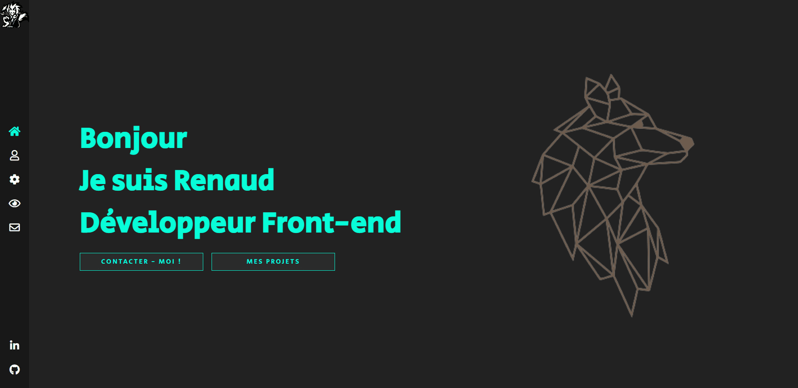

<div align="center">
  
</div>
<h1 align="center">
  portfolio-renaud-fradin.netlify.app - V3
</h1>

<!--  -->

## 🛠 Installation & Set Up

1. Install dependencies

```bash
npm install
```

2. Start the development server

```bash
npm run dev
# or
yarn dev
# or
pnpm dev
```
