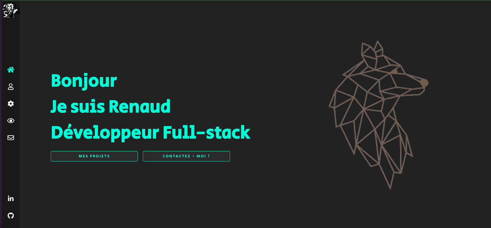

<div align="center">
  
</div>

<h1 align="center">
  <a href="https://renaudfradin.vercel.app/" target="_blank">
    renaudfradin.vercel.app - v2
  </a>
</h1>



## 🛠 Installation & Set Up

1. Install dependencies

```sh
npm install
```

2. Start the development server

```sh
npm run dev
```
